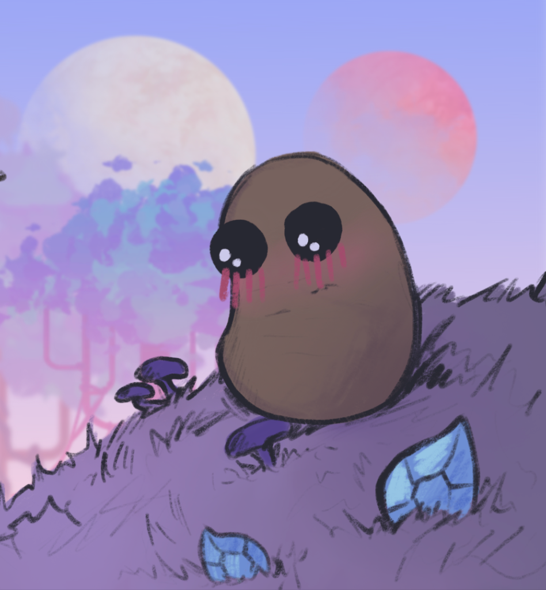
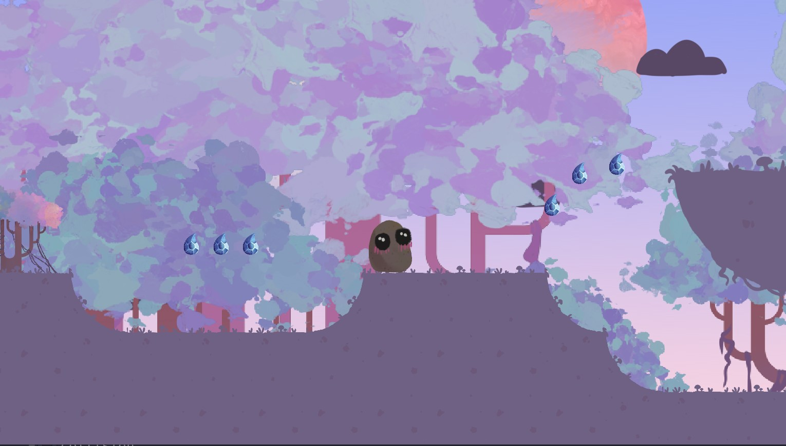
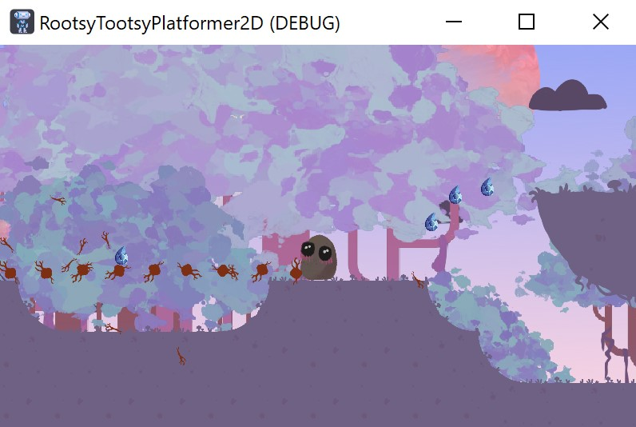
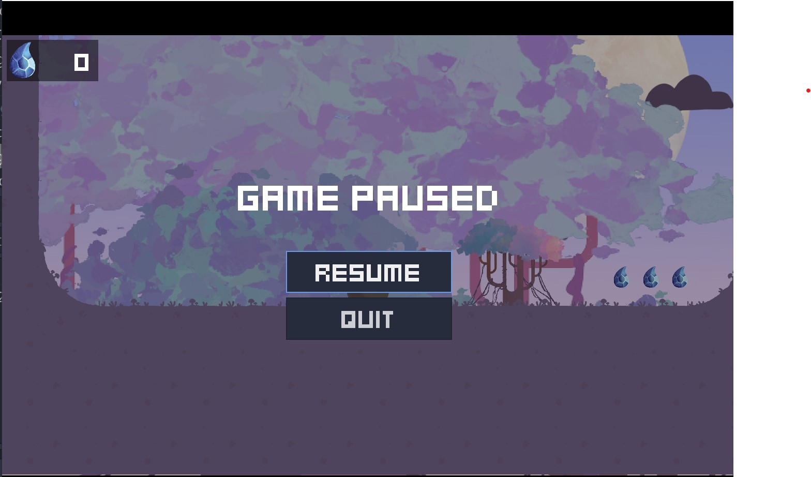

# RootsyTootsyPlatformer

2D platformer where you play a lovely vegetable character exploring a beautiful roots dominated world while collecting resources and fighting enemies!
Jam Site: Global GameJam Graz 2023

Credits: Phil Gosch, Stefan Putzinger, Eva Chaves Diaz

Controls: Arrow keys + Space

Game Stills: 

